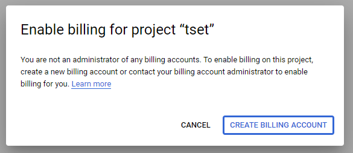

# GeoGuess Deployment Instructions

## 1) Deploy GeoGuess

You can deploy the game with : 

 or 
[](https://vercel.com/new/git/external?repository-url=https%3A%2F%2Fgithub.com%2FGeoGuess%2FGeoguess&env=VUE_APP_API_KEY,VUE_APP_FIREBASE_API_KEY,VUE_APP_FIREBASE_AUTH_DOMAIN,VUE_APP_FIREBASE_DATABASE_URL,VUE_APP_FIREBASE_PROJECT_ID,VUE_APP_STORAGE_BUCKET,VUE_APP_FIREBASE_MESSAGING_SENDER_ID,VUE_APP_FIREBASE_APP_ID,VUE_APP_FIREBASE_MEASUREMENT_ID&envDescription=Follow%20guide%20on%20https%3A%2F%2Fgeoguess.games%2F&envLink=https%3A%2F%2Fgeoguess.games%2F&project-name=my-geoguess&demo-title=GeoGuess&demo-description=GeoGuess%20is%20an%20open-source%20geography%20game%20with%20Google%20Map%20StreetView.%20You%20can%20play%20solo%20or%20with%20your%20friends%20simultaneously.&demo-url=https%3A%2F%2Fdemo.geoguess.games%2F&demo-image=https%3A%2F%2Fgeoguess.games%2Fimg%2Fsocial.jpg)

It will be ask to give Environment variables, we will explain how to create and find them.

## 2) Environment variables
### 2.1) Google Map

> Environnement variable : VUE_APP_API_KEY

1. Google Cloud, your 1st project ?
    1. Go to [https://cloud.google.com/maps-platform/](https://cloud.google.com/maps-platform/)
    2. Click on "Get started"
    3. Page will open and ask you to activate billing
    
    > **Note :** Google offers 200 $ credit per month to use Google Map Apis ([Source](https://cloud.google.com/maps-platform/pricing)). For personal usage, you won't use more than the free credit.
    4. Create Billing Account

1.(bis) Google Cloud, I know 💪 then create a project

2. In the "MarketPlace", activate "Maps JavaScript API"
3. In "Identifiants", generate on API key. This key will be your `VUE_APP_API_KEY`
> You can define quota et restriction

> More information : [https://developers.google.com/maps/gmp-get-started](https://developers.google.com/maps/gmp-get-started)

### 2.2) Firebase (multiplayer)

> Environment variables : VUE_APP_FIREBASE_API_KEY, VUE_APP_FIREBASE_PROJECT_ID, VUE_APP_FIREBASE_MESSAGING_SENDER_ID, VUE_APP_FIREBASE_APP_ID et VUE_APP_FIREBASE_MEASUREMENT_ID, VUE_APP_FIREBASE_AUTH_DOMAIN, VUE_APP_FIREBASE_DATABASE_URL, VUE_APP_STORAGE_BUCKET

1. Create a Firebase project (or use the Google Cloud project create for Google Map Api) on [https://console.firebase.google.com/](https://console.firebase.google.com/)
> You can activate Google Analytics to get statistics
2. Go in the section "Develop" and click on "Realtime Database", create a database
3. Go in the Rules Section
    1. Replace, 2 variable (.write et .read) `false` by `true` in the textarea

    2. Publish

1. Return on the home page with "Project Overview" 
2. Under the title of the project, click on Web icon `</>` to add an application

1. Save the application then get Environment variables reveals under `firebaseConfig` 

Here are the associations:

| Parameter         | Env. Variables                       |
| ----------------- | ------------------------------------ |
| apiKey            | VUE_APP_FIREBASE_API_KEY             |
| authDomain        | VUE_APP_FIREBASE_AUTH_DOMAIN         |
| databaseURL       | VUE_APP_FIREBASE_DATABASE_URL        |
| projectId         | VUE_APP_FIREBASE_PROJECT_ID          |
| storageBucket     | VUE_APP_STORAGE_BUCKET               |
| messagingSenderId | VUE_APP_FIREBASE_MESSAGING_SENDER_ID |
| appId             | VUE_APP_FIREBASE_APP_ID              |
| measurementId     | VUE_APP_FIREBASE_MEASUREMENT_ID      |

> **Note**: `measurementId` was accessible if you have activate Google Analytics
<!--imageSocial"https://geoguess.games/img/social.jpg"-->